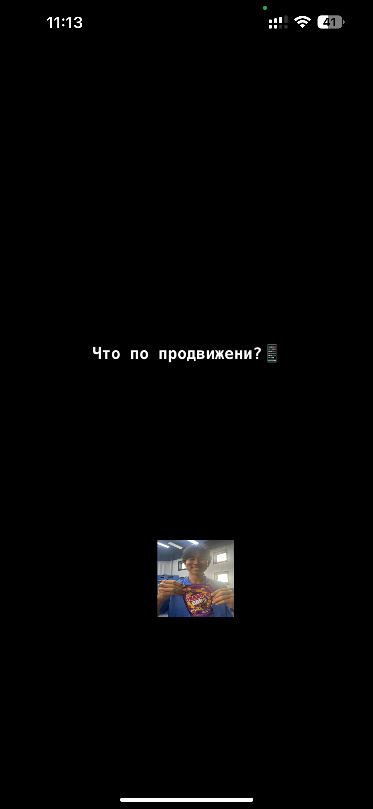

# FunCubator AR 🎉

A one‑day hackathon project that mashes up **ARKit**, **RealityKit**, **SwiftUI** and **SpriteKit** into a single playground of meme‑laden mini‑games inspired by the nFactorial bootcamp culture.

| Mini‑Game               | What you do                                                                                                | Tech                              |
| ----------------------- | ---------------------------------------------------------------------------------------------------------- | --------------------------------- |
| **Массажка**            | Rub the on‑screen back as fast as possible to rack up 25 000 points in 5 s                                 | SwiftUI + haptics                 |
| **CEO Costume Fitting** | Time your taps to slide the top & bottom of a suit onto the figure five times before 3 misses              | SwiftUI timers + gesture logic    |
| **Mentor Roast**        | Hold & move a reactive shield, deflect living code‑review questions and survive 2 minutes (3 waves + boss) | SpriteKit physics, audio, haptics |

---

## 🚀 Quick start

```bash
# 1. clone & open
$ git clone https://github.com/<you>/FunCubatorAR.git
$ open FunCubatorAR/FunCubatorMassageAR.xcodeproj

# 2. make sure assets are in Assets.xcassets 👇
#    massage / ceo / bahr / ceoFace / costumeTop / costumeDown / huesitos / okay / done / model / figure.stand

# 3. run on a *real* device (iPhone XS or newer)
```

> **Requires:** Xcode 15+, iOS 17+, an A12 device (TrueDepth + ARKit) and camera permissions.

---

## 🕹 Controls & UX cheatsheet

| Context      | Action                                                                                                              |
| ------------ | ------------------------------------------------------------------------------------------------------------------- |
| AR Lobby     | • Tap **Массажка** / **Стать CEO** / **Mentor Roast** floating cards to launch a game                               |
| Массажка     | • Drag anywhere on the back → +100 points per meaningful stroke                                                     |
| CEO Costume  | • Tap **"Остановить верх"** / **"Остановить низ"** buttons once to lock the slider • 5 hits → win, 3 misses → lose  |
| Mentor Roast | • Touch & hold to spawn a shield, drag to block • Shield overheats after 3 s → cool‑down 1 s • 120 s survival → win |

Haptic feedback and screen shake signal hits, overheats, boss damage and defeat.

---

## 🏗 Architecture

```
ContentView                 (root SwiftUI view)
 ├─ ARViewContainer          (RealityKit menu)
 │    ├─ massageGroup (Entity)
 │    ├─ ceoGroup     (Entity)
 │    └─ mentorGroup  (Entity)
 ├─ MassageView              (SwiftUI mini‑game 1)
 ├─ CostumeGameView          (SwiftUI mini‑game 2)
 └─ RoastGameView            (SpriteKit wrapper → RoastScene)
```

* **RealityKit** ‑ anchors the floating menu at origin *(0 m, 0 m, ‑0.6 m)*.
* **SpriteKit** ‑ self‑contained physics scene; gravity & spawn rate adapt per wave.
* **AVFoundation** ‑ plays the mentor’s “nuuu.mp3” boss taunt.

---

## 📸 Screenshots

### 💻 Main Menu


### 👐 Massage Game


### 🕴 Costume Game


### 🔥 Mentor Roast


